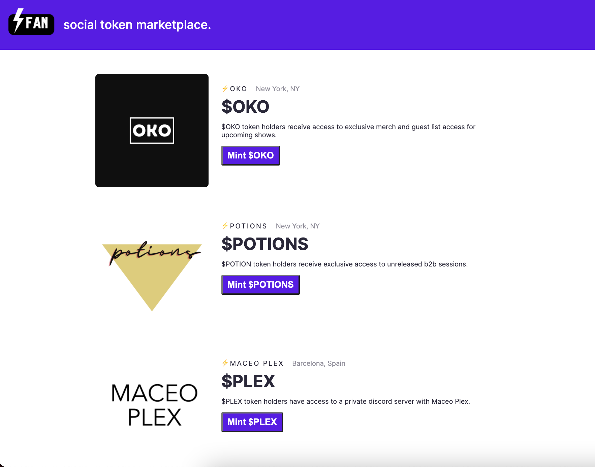

# FAN Social Token 

## FAN Overview
### Problem
How can we connect content creators direclty to their fans? But why do content creators need a direct line of communication to their fans? 

### Solution
Content creators may want to reward their most loyal fans with exclusive access to their content. We can create this direct line of communication by having fans mint tokens (ERC-1155) for their favorite content creators.

## Requirements

- [Node.js](https://nodejs.org/) 14.x or later
- An [Infura](https://infura.io/) account and Project ID
- A [MetaMask](https://metamask.io/) account
- Install Truffle:  `npm install -g truffle`
- Install ganache CLI:  `npm install -g ganache-cli`
- Install: `npm i truffle-hdwallet-provider`
- Install: `npm i @openzeppelin/contracts`
- Install: `npm install @eth-optimism/solc@latest`

 
## Setup prior to deploying contracts

### Setting up the env File

1. Use `touch .env` in the command line to create a `.env` file at the root of your project.
2. Copy and paste the code below into the new `.env` file.
```
MNEMONIC="<Your Mnemonic>"
INFURA_PROJECT_ID="<Your Infura Project ID>"
```

3. Add the 12-word seed phrase which can be found in your Metamask wallet by clicking on the hamburger, `Settings`, then Security & Privacy. The seed phrase should be copied and pasted into `.env` file right after `MNEMONIC=` with no spaces.<br>
***IMPORTANT*** The seed phrase should be from your Ethereum development wallet with only testnet ETH, not a live Mainnet wallet.
4. Copy and paste your Infura Project ID to `.env` after `INFURA_PROJECT_ID=` with no spaces.

### Adding Optimism Kovan ETH tokens to Metamask
1. You will need a funded Optimism Kovan wallet to deploy the contracts on Polygon.

## Compiling and Migrating to development testnet
1. Open another terminal and enter `ganache-cli` to start the development server on localhost port:8545.
2. Compile your contracts with `truffle compile`.
3. Migrate contracts to the local dev testnet with `truffle migrate --network development`.

## Compiling and Migrating to Optimism Kovan testnet
1. Compile your contracts with `truffle compile`.
2. Migrate your contracts to the Rinkeby ETH testnet with `truffle migrate --network optimism-kovan`.
3. You can check your contracts by copy and pasting the truffle contract address output into https://kovan-optimistic.etherscan.io/
4. Save this contract address for the minting process.

## Installing and running frontend
1. In project root, cd into the `frontend` directory 
2. Use `npm install` to install the front-end
3. Start the front-end with `npm run start`.

## Minting Optimism Kovan
1. Login to your Metamask account and choose the Optimism Kovan network with your funded Optimism Kovan address.
2. Click `Mint NFT`, then `Confirm` on the Metamask pop up screen.
3. Wait 15-20 minutes and check your Optimism Kovan address at https://testnets.opensea.io/. You should see your minted NFT in a new collection.


